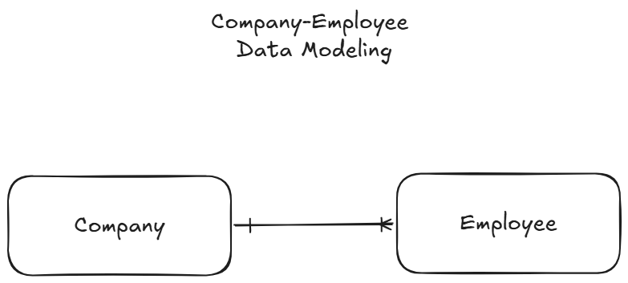

# Django Rest Framework (Company-Employee)

## Summary

This is a basic project to practise how Django REST Framework operates. This project consists of backend APIs only & contains 2 models: **Company** & **Employee**.

## How to Setup

1. Create a Python virtual environment.

   > python -m venv env

2. Activate the virtual environment.

   > Bash: source env/bin/activate

3. Install all the dependencies.

   > pip install -r requirements.txt

4. Run the server using a shell script.

   > bash server.sh

<small>💡 Note: The shell script includes the `migration` commands along with the `runserver` command.</small>

## High Level Design

A conceptual data model is demonstrated below

